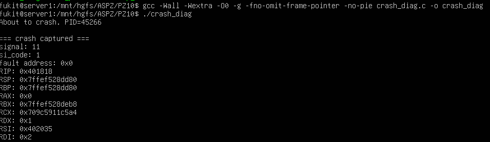
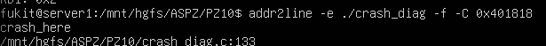
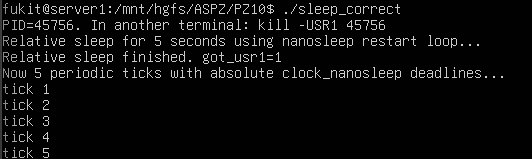
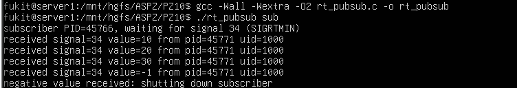
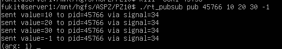

# Практичне завдання 10
Цей репозиторій містить звіти та інструкції до виконання практичного завдання з дослідженням робіт лекції 13: Signaling — Part 2


## Вимоги до середовища
* **ОС:** Linux (наприклад, Ubuntu) або середовище WSL.
* **Компілятор:** gcc.

### Приклад 1:
Протестовано програму, яка замість стандартного "падіння" перехоплює критичні системні сигнали (такі як SIGSEGV, SIGILL, SIGFPE) за допомогою системного виклику sigaction. У функції crash_here() навмисно спровоковано збій шляхом запису значення 42 за нульовою адресою пам'яті (NULL вказівник). При виникненні помилки викликається власна функція crash_handler, яка витягує з контексту процесора (ucontext_t) поточний стан регістрів та виводить їх на екран без використання високорівневих функцій вводу-виводу (через безпечний write), після чого безпечно завершує процес.

**Компіляція і запуск:**
```bash
gcc -Wall -Wextra -O0 -g -fno-omit-frame-pointer -no-pie crash_diag.c -o crash_diag
./crash_diag
```



Аналіз результатів тестування:

signal: 11: Це стандартний код для SIGSEGV (Segmentation fault). Система зафіксувала спробу доступу до забороненої ділянки пам'яті.

si_code: 1: Код SEGV_MAPERR, що означає звернення до адреси, яка взагалі не відображена в адресному просторі процесу.

fault address: 0x0: Точна адреса, яка викликала збій. Вона дорівнює нулю, оскільки у коді було створено вказівник (int *)0.

RIP: 0x401818: Регістр вказівника інструкцій (Instruction Pointer) архітектури x86-64. Він містить адресу машинної команди, на якій зупинилося виконання.

Локалізація помилки через addr2line:
Для того, щоб перетворити "сиру" адресу з регістра RIP на конкретний рядок у вихідному коді мовою C, програма компілювалася з прапорцем налагодження -g. Далі використовується системна утиліта addr2line.

Примітка до виконання: Щоб знайти місце самого "падіння", необхідно передати значення RIP з останнього логу (у нашому випадку це 0x401818).

Команда для точної локалізації місця збою:
```bash
addr2line -e ./crash_diag -f -C 0x401818
```



### Приклад 2:
Програма демонструє два надійні способи призупинення виконання потоку, які є стійкими до переривань системними сигналами.

Спочатку використовується виклик nanosleep всередині циклу. Якщо процес "прокидається" достроково через отримання сигналу (система повертає помилку EINTR), програма автоматично зчитує структуру із залишком часу (rem) і продовжує сон, гарантуючи, що загальний час очікування не скоротиться.

Друга частина демонструє створення ідеально рівних періодичних інтервалів за допомогою clock_nanosleep з прапорцем TIMER_ABSTIME та системним таймером CLOCK_MONOTONIC. Цей підхід повністю усуває накопичення часової похибки (дрифту). Час кожного наступного пробудження розраховується як фіксована абсолютна точка в майбутньому, і навіть якщо обробка сигналу займе певний час, наступний "тік" відбудеться чітко за розкладом.



Аналіз результатів тестування:

Під час запуску програма вивела свій ідентифікатор PID=45756 і розпочала першу фазу — відносний сон на 5 секунд.

У цей час з іншого термінала було надіслано команду kill -USR1 45756.


Вивід got_usr1=1 свідчить про те, що сигнал було успішно доставлено та перехоплено кастомним обробником on_usr1.

Найголовніший результат першої фази: незважаючи на переривання обробником сигналу, програма не перервала виконання nanosleep достроково. Цикл з перевіркою EINTR відпрацював коректно, змусивши процес доспати залишок від 5 секунд.

У другій фазі програма стабільно вивела 5 повідомлень (tick 1 ... tick 5) з інтервалом рівно в 1 секунду, довівши коректну роботу абсолютного планування через clock_nanosleep.

### Приклад 3:
В програмі реалізовано патерн "Видавець-Підписник" (Publisher-Subscriber) з використанням сигналів реального часу (Real-Time Signals). На відміну від стандартних POSIX-сигналів (які можуть об'єднуватися, якщо надходять занадто швидко), сигнали реального часу стають у чергу, що гарантує доставку кожного з них. Крім того, вони дозволяють передавати разом із сигналом корисне навантаження (payload) — у цьому випадку ціле число.

Підписник (Subscriber): Спочатку блокує сигнал SIGRTMIN за допомогою sigprocmask, щоб запобігти його асинхронній обробці за замовчуванням. Далі він входить у безкінечний цикл, де синхронно очікує надходження сигналу через системний виклик sigwaitinfo, після чого витягує передане число з поля si_value.sival_int структури siginfo_t.

Видавець (Publisher): Використовує системний виклик sigqueue для цілеспрямованої відправки сигналу SIGRTMIN та прикріпленого до нього значення вказаному процесу (за його PID).

Аналіз результатів тестування:

У першому терміналі було запущено процес-підписник. Система виділила йому PID=45766, і він почав прослуховувати сигнал номер 34 (базове значення SIGRTMIN у вашій системі Linux).



У другому терміналі запущено процес-видавець, якому в аргументах передали PID підписника та серію значень для відправки: 10 20 30 -1.



Як видно з виводу першого термінала, підписник миттєво отримав усі 4 повідомлення у правильній послідовності. Для кожного повідомлення система успішно розпакувала передане значення (value=10, 20, 30, -1) та ідентифікувала відправника (PID=45771).

Отримавши значення -1, підписник розпізнав його як команду на зупинку, вивів відповідне повідомлення (negative value received: shutting down subscriber) та коректно завершив роботу. Доведено надійність передачі даних через чергу RT-сигналів.

### Завдання 10.1 (Варіант 16):
У програмі системним викликом `fork()` створюються два паралельні дочірні процеси. Для наочності перший процес виконується довше (засинає на 3 секунди), а другий — швидше (засинає на 1 секунду). 

Батьківський процес викликає функцію `waitpid()` і явно передає їй ідентифікатор (`PID`) лише першого (повільного) дочірнього процесу. Незважаючи на те, що другий процес завершує свою роботу набагато раніше, батьківський процес ігнорує його статус і слухняно чекає всі 3 секунди до завершення саме того процесу, який був вказаний в аргументі.

**Запуск:**
```bash
gcc -Wall 10_16.c -o task10_16
./task10_16
```

