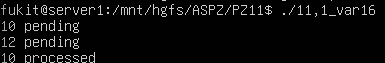

# Практичне завдання 11
Цей репозиторій містить звіти та інструкції до виконання практичного завдання з дослідженням робіт практичного заняття 11

## Вимоги до середовища
* **ОС:** Linux (наприклад, Ubuntu) або середовище WSL.
* **Компілятор:** gcc.

### Завдання 11.1 (Варіант 16): 
Програма демонструє повний цикл роботи з масками сигналів та їх станами. 
1. За допомогою sigaction встановлюється порожній обробник для сигналів SIGUSR1 та SIGUSR2, щоб перехопити їхню стандартну поведінку.
2. Викликом sigprocmask ці два сигнали додаються до маски блокування процесу (SIG_BLOCK).
3. Програма штучно генерує ці сигнали системним викликом raise(). Оскільки вони заблоковані, ОС доставляє їх процесу, але не обробляє, переводячи у стан "в очікуванні" (pending).
4. За допомогою sigpending програма отримує набір усіх очікуючих сигналів та в циклі перевіряє кожен номер від 1 до 31, виводячи на екран ті, які наразі заблоковані та чекають на обробку.
5. Наприкінці використовується функція sigwaitinfo, яка призупиняє програму до моменту, поки не буде синхронно отримано один із заблокованих сигналів. Після його обробки сигнал вилучається з черги очікування.

**Запуск:**
```bash
gcc -Wall 11,1_var16.c -o 11,1_var16
./11,1_var16
```

