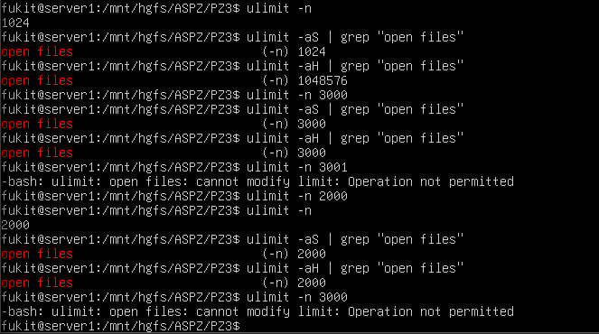
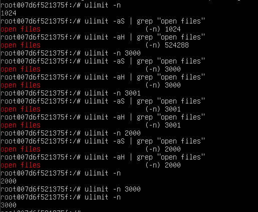
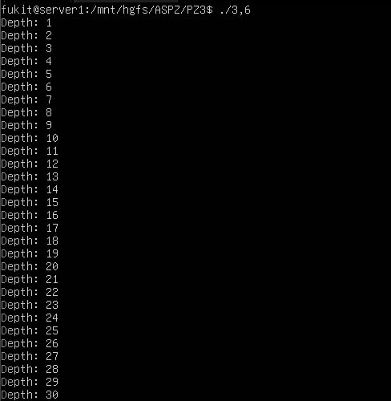
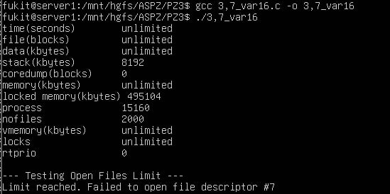

# Практичне завдання 3
Цей репозиторій містить звіти та інструкції до виконання практичних завдань з дослідження сегментів пам'яті, роботи стека викликів, управління віртуальною пам'яттю та налаштування лімітів ресурсів в ОС Linux (у тому числі в ізольованому середовищі Docker).

## Вимоги до середовища
* **ОС:** Linux (наприклад, Ubuntu) або середовище WSL.
* **Компілятор:** `gcc`.
* **Права:** sudo (для роботи з Docker та системними лімітами).

---

## Опис завдань

### Завдання 3.1:
Запущено ізольований контейнер Docker. За допомогою вбудованої команди оболонки ulimit було досліджено м'які (-aS) та жорсткі (-aH) ліміти кількості відкритих файлових дескрипторів (-n). На практиці перевірено, що користувач без прав root може змінювати ліміти лише в межах поточного жорсткого обмеження.

Команди для виконання:
```bash
sudo docker run -it ubuntu bash
ulimit -n
ulimit -aS | grep "open files"
ulimit -aH | grep "open files"
ulimit -n 3000
```



> [!NOTE]
> Примітка: Звичайний користувач може лише знижувати жорсткий ліміт. Для його підвищення потрібні права root.

### Завдання 3.2:
Контейнер було запущено зі спеціальним прапорцем --privileged. Це надало контейнеру доступ до системного ядра хост-машини, що є обов'язковою вимогою для встановлення та коректної роботи утиліти perf (інструмент для низькорівневого аналізу продуктивності процесів).

Команди для запуску та встановлення:
```bash
sudo docker run --privileged -it ubuntu bash
apt-get update && apt-get install -y linux-tools-common linux-tools-generic
perf --version
```



### Завдання 3.3:
У програмі, що імітує кидання кубика, перед початком запису у файл системним викликом setrlimit встановлено обмеження на розмір генерованого файлу (20 байт). Щоб програма не "падала" з системною помилкою при перевищенні ліміту, використано функцію signal() для перехоплення сигналу SIGXFSZ та виводу повідомлення про штатне завершення.

#### Компіляція та запуск:
```bash
gcc 3,3.c -o 3,3
./3,3
```

### Завдання 3.4: 
Реалізовано нескінченний цикл для генерації лотерейних чисел. Перед циклом функцією setrlimit встановлено жорсткий ліміт CPU-часу процесу в 1 секунду. При його вичерпанні ОС надсилає процесу сигнал SIGXCPU, який успішно перехоплюється спеціально написаним обробником.

#### Компіляція та запуск:
```bash
gcc 3,4.c -o 3,4
./3,4
```

### Завдання 3.5: 
Написано утиліту для побайтового копіювання. На початку роботи додано перевірки кількості переданих аргументів (argc), а також перевірки успішності викликів fopen (на читання та на запис). Додано обробник сигналу SIGXFSZ на випадок, якщо цільовий файл у процесі копіювання перевищить системні обмеження розміру.

#### Компіляція та запуск:
```bash
gcc 3,5.c -o 3,5
./3,5 3,5_exp1.txt 3,5_exp2.txt
```

### Завдання 3.6: 
Щоб спровокувати переповнення стека (Stack Overflow), написано функцію з масивними локальними змінними, яка рекурсивно викликає саму себе. Перед її запуском системним викликом setrlimit ліміт пам'яті стека штучно занижено до 16 КБ. Це дозволяє миттєво досягти ліміту і отримати помилку Segmentation Fault.

#### Компіляція та запуск:
```bash
gcc 3,6.c -o 3,6
./3,6
```


### Завдання 3.7: 
Спочатку програма робить системний виклик system("ulimit -a") для виводу всіх активних лімітів процесу. Після цього програма через setrlimit штучно знижує ліміт відкритих файлових дескрипторів (RLIMIT_NOFILE) до 10 і в циклі намагається відкрити 20 системних файлів /dev/null. Як тільки ліміт досягається, fopen повертає помилку, що доводить роботу обмеження.

#### Компіляція та запуск:
```bash
gcc 3,7_var16.c -o 3,7_var16
./3,7_var16
```


