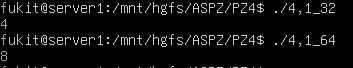
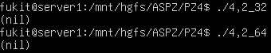
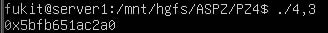
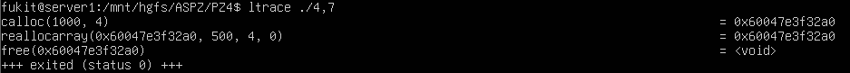

# Практичне завдання 4
Цей репозиторій містить звіти та інструкції до виконання практичних завдань з дослідження поведінки стандартних функцій виділення пам'яті в мові C, аналізу крайових випадків (переповнення, нульові або від'ємні розміри) та вивченню фрагментації адресного простору.

## Вимоги до середовища
* **ОС:** Linux (наприклад, Ubuntu) або середовище WSL.
* **Компілятор:** gcc(з підтримкою пакета gcc-multilib для 32-бітної компіляції).
* **Інструменти:** ltrace.

## Опис завдань

### Завдання 4.1: 
Досліджено розмір типу size_t. На 64-бітній платформі він становить 8 байтів, що обмежує максимальний блок значенням $2^{63}-1$ (через використання знакового типу ptrdiff_t для різниці вказівників), тобто 8 ексабайтами. Запуск програми на 32-бітній архітектурі демонструє зменшення цього ліміту до 2 ГБ.

#### Компіляція та запуск (64 та 32 біти):
```bash
gcc 4,1.c -o 4,1_64
./4,1_64

gcc -m32 4,1.c -o task4,1_32
./4,1_32
```



### Завдання 4.2: 
Перевірено поведінку malloc при передачі від'ємного значення. Оскільки аргумент функції має беззнаковий тип size_t, від'ємне число через цілочисельне переповнення конвертується у гігантське додатне число (наприклад, -1 стає $2^{64}-1$). ОС фізично не може виділити такий блок пам'яті, і функція штатно повертає NULL без "падіння" програми.



### Завдання 4.3: 
Досліджено виклик виділення пам'яті нульового розміру. У бібліотеці glibc (Linux) він повертає не NULL, а валідний унікальний вказівник на мінімально можливий блок пам'яті (зазвичай 16 або 32 байти). Продемонстровано, що цей вказівник обов'язково потрібно звільняти викликом free().

#### Компіляція та запуск:
```bash
gcc 4,3.c -o 4,3
ltrace ./4,3
```



### Завдання 4.4: 
Проаналізовано наданий проблемний код. Виявлено класичні вразливості: Use-After-Free (спроба використати пам'ять після звільнення) та Double-Free (подвійне звільнення одного й того ж вказівника на наступній ітерації). Помилку виправлено шляхом встановлення вказівника у стан NULL (ptr = NULL;) одразу після виклику free(ptr).

### Завдання 4.5: 
Змодельовано ситуацію, коли realloс не може розширити блок пам'яті (було надіслано запит на максимальний розмір SIZE_MAX, прихований від компілятора модифікатором volatile, щоб уникнути оптимізації). Доведено, що старий блок при помилці realloc не звільняється системою. Для уникнення витоку пам'яті (Memory Leak) реалізовано ручне звільнення старого вказівника через free().


### Завдання 4.6: 
Перевірено крайові випадки роботи функції. Практично доведено, що виклик realloc(NULL, size) є повним аналогом звичайного malloc(size). Натомість виклик realloc(ptr, 0) відпрацьовує аналогічно до free(ptr) і повертає NULL.

### Завдання 4.7: 
Стандартний виклик realloc з ручним множенням елементів (кількість * розмір) замінено на безпечну функцію reallocarray. Через трасування системних викликів (ltrace) показано, що reallocarray приймає два аргументи і самостійно їх перемножує, попередньо перевіряючи можливість цілочисельного переповнення, що захищає програму від виділення некоректного обсягу пам'яті.

#### Запуск трасування:
```bash
gcc 4,7.c -o 4,7
ltrace ./4,7
```



### Завдання 4.8(варіант 16): 
Створено сценарій штучної фрагментації адресного простору купи (Heap). У циклі реалізовано "шахове" чергування алокацій великих (10000 байт) і малих (10 байт) блоків. Після цього звільняються лише великі блоки. Доведено, що хоча сумарно вільної пам'яті цілком достатньо, вона розбита на дрібні фрагменти, ізольовані зайнятими малими блоками. Через це виділення одного великого суцільного блоку пам'яті у цьому ж діапазоні адрес стає неможливим. 