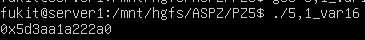

# Практичне завдання 5
Цей репозиторій містить звіти та інструкції до виконання практичного завдання з дослідження помилок роботи з пам’яттю в Linux та засобів їх усунення

## Вимоги до середовища
* **ОС:** Linux (наприклад, Ubuntu) або середовище WSL.
* **Компілятор:** gcc.

### Завдання 5.1: 
На 64-бітній системі (модель даних LP64) вказівники на пам'ять мають розмір 64 біти (8 байтів), тоді як стандартні цілочисельні типи, такі як int або uint32_t, мають розмір 32 біти (4 байти). У програмі виділяється пам'ять, а вказівник примусово приводиться до 32-бітного цілого числа. Під час цього процесу старші 32 біти оригінальної адреси просто відкидаються системою (відбувається усічення). 

Коли це "обрізане" число приводиться назад до типу вказівника, ми отримуємо зовсім іншу, пошкоджену адресу (яка завжди знаходиться в межах нижніх 4 ГБ адресного простору). Будь-яка спроба звернутися за цією новою адресою призведе до помилки доступу до пам'яті (Segmentation fault).

#### Компіляція та запуск
```bash
gcc 5,1_var16.c -o 5,1_var16
./5,1_var16
```

