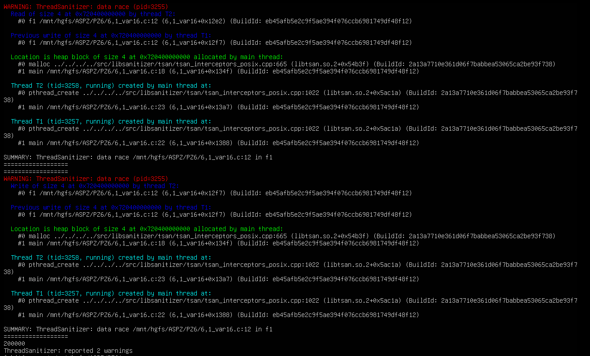

# Практичне завдання 6
Цей репозиторій містить звіти та інструкції до виконання практичного завдання з дослідженням інструментів налагодження для проблем з пам'яттю

## Вимоги до середовища
* **ОС:** Linux (наприклад, Ubuntu) або середовище WSL.
* **Компілятор:** gcc.

### Завдання 6.1:
У купі (malloc) створено структуру з одним цілочисельним полем. Далі програма запускає два паралельні потоки (pthreads), кожен з яких багаторазово збільшує значення цього поля в циклі без використання м'ютексів чи атомарних операцій. Це створює класичну "умову гонки" (Data Race). Щоб локалізувати та довести наявність цієї проблеми, програму скомпілювано з прапорцем -fsanitize=thread. Під час виконання ThreadSanitizer автоматично перехоплює конфлікт пам'яті і виводить детальний звіт про те, які саме потоки намагалися одночасно змінити одні й ті самі дані.

**Запуск та локалізація проблеми:**
```bash
gcc -fsanitize=thread -g 6,1_var16.c -lpthread -o 6,1_var16
./task6_16
```
