# Практичне завдання 7
Цей репозиторій містить звіти та інструкції до виконання практичного завдання з дослідженням роботи з файловими системами, процесами та утилітами UNIX

## Вимоги до середовища
* **ОС:** Linux (наприклад, Ubuntu) або середовище WSL.
* **Компілятор:** gcc.

### Завдання 7.1:
Відкрито два канали за допомогою popen. Перший виконує системну команду rwho у режимі читання, другий — more у режимі запису. Програма побітово читає вивід першої команди і передає його на вхід другій.

**Запуск:**
```bash
gcc -Wall 7,1.c -o 7,1
./7,1
```
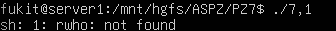

### Завдання 7.2:
Програма відкриває поточний каталог (opendir), читає всі файли через readdir і отримує метадані кожного файлу за допомогою виклику stat. Виводяться права доступу у вісімковому форматі (octal), UID, GID, розмір файлу та його назва.

**Запуск:**
```bash
gcc -Wall 7,2.c -o 7,2
./7,2
```
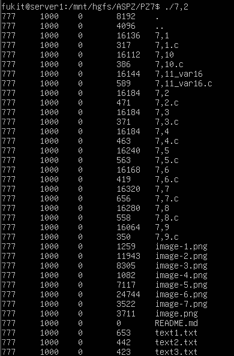

### Завдання 7.3:
Програма приймає шукане слово та ім'я файлу як аргументи командного рядка (argv). Відкриває файл, читає його по рядках за допомогою fgets і перевіряє наявність слова в рядку функцією strstr().

**Запуск:**
```bash
gcc -Wall 7,3.c -o 7,3
./7,3 Suspendisse(слово для пошуку) text1.txt
```
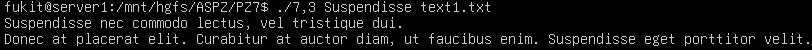

### Завдання 7.4:
Цикл перебирає файли, передані в аргументах. Рядки виводяться на екран зі збереженням лічильника. Коли лічильник стає кратним 20, програма використовує getchar(), очікуючи від користувача натискання клавіші Enter для продовження.

**Запуск:**
```bash
gcc -Wall 7,4.c -o 7,4
./7,4 text1.txt text2.txt
```
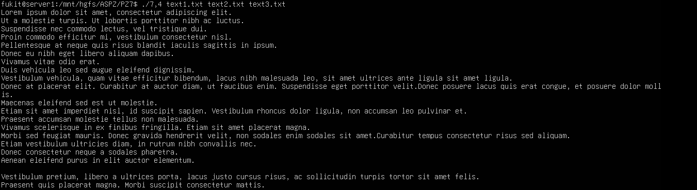

### Завдання 7.5:
Реалізовано рекурсивну функцію. Вона читає каталог, і якщо зустрічає елемент із типом DT_DIR (що не є . або ..), то склеює поточний шлях з назвою знайденого каталогу та викликає саму себе для його обробки.

**Запуск:**
```bash
gcc -Wall 7,5.c -o 7,5
./7,5
```
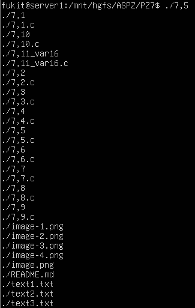

### Завдання 7.6:
Використано функцію scandir. Їй передано кастомний фільтр, який відкидає всі елементи, окрім тих, що мають тип DT_DIR, а для сортування масиву передано вбудовану функцію alphasort.

**Запуск:**
```bash
gcc -Wall 7,6.c -o 7,6
./7,6
```
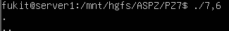

### Завдання 7.7:
Програма шукає у каталозі файли з підрядком .c. Для кожного такого файлу через scanf запитує підтвердження. У разі відповіді y програма читає існуючі права (stat) та додає до них прапорець читання для інших користувачів (S_IROTH) за допомогою chmod().

**Запуск:**
```bash
gcc -Wall 7,7.c -o 7,7
./7,7
```
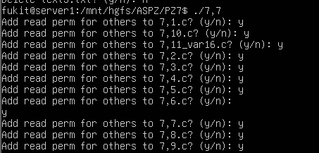

### Завдання 7.8:
Сканується каталог з ігноруванням спеціальних посилань . та ... Перед кожним файлом очікується введення символу y. За позитивної відповіді файл видаляється системним викликом unlink().

**Запуск:**
```bash
gcc -Wall 7,8.c -o 7,8
./7,8
```
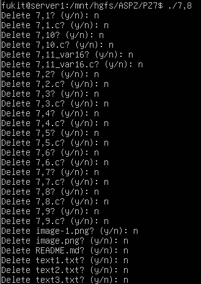

### Завдання 7.9:
Використано gettimeofday() перед початком порожнього циклу та після його завершення. Час (секунди та мікросекунди) переведено в мілісекунди, після чого обчислено їх різницю для визначення точного часу роботи фрагмента коду.

**Запуск:**
```bash
gcc -Wall 7,9.c -o 7,9
./7,9
```
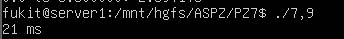

### Завдання 7.10:
Для гарантії унікальності послідовності генератор ініціалізовано поточним часом (srand(time(NULL))). Для отримання числа від 0.0 до 1.0 результат rand() ділиться на константу RAND_MAX. Для діапазону до числа n (з аргументу) базовий дріб додатково множиться на потрібне значення.

**Запуск:**
```bash
gcc -Wall 7,10.c -o 7,10
./7,10 n
```
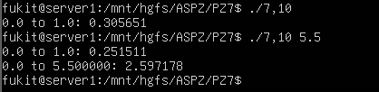

### Завдання 7.11(варіант 16):
Використовується системний виклик ioctl із прапорцем FIBMAP. Він дозволяє процесу запитати у ядра фізичний номер блоку на диску для кожного логічного блоку файлу. Програма перевіряє послідовність цих блоків: якщо наступний фізичний блок не йде одразу за попереднім, фіксується розрив (фрагментація). Примітка: для роботи FIBMAP потрібні права суперкористувача.

**Запуск:**
```bash
gcc -Wall 7,11_var16.c -o 7,11_var16
sudo ./7,11_var16 /var/log/syslog (файл для перевірки)
```
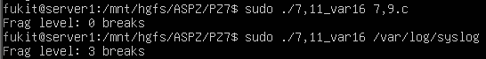