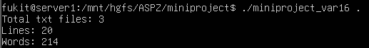

# Звіт: Багатопотоковий обробник файлів (Варіант 16)

## Мета роботи:
Створити програму для паралельної обробки текстових файлів у директорії з використанням багатопотоковості. Закріпити навички роботи з потоками (стандарт POSIX Threads), механізмами синхронізації (м'ютексами) та обробкою помилок системних викликів в ОС Linux.

## Опис реалізації:
Програма запускається з командного рядка і приймає шлях до директорії як аргумент (за замовчуванням використовується поточна директорія `.`). 
Виконується сканування директорії. Для кожного знайденого файлу з розширенням `.txt` програма динамічно виділяє пам'ять під збереження шляху та створює новий потік. 
Кожен потік відкриває закріплений за ним файл, зчитує його вміст посимвольно та підраховує кількість рядків і слів. Для безпечного оновлення загальної статистики (глобальних змінних) використовується м'ютекс, який блокує доступ інших потоків на момент запису результатів. Головний процес очікує завершення всіх створених потоків і виводить загальну кількість файлів, рядків та слів. 
У коді реалізована перевірка на успішність відкриття директорій та файлів (обробка помилок системних викликів).

## Використані системні виклики та функції бібліотек:
* `opendir()`, `readdir()`, `closedir()` — відкриття, читання та закриття директорії.
* `fopen()`, `fgetc()`, `fclose()` — робота з файловими потоками.
* `malloc()`, `free()` — виділення та звільнення пам'яті для передачі аргументів у потоки.
* `pthread_create()`, `pthread_join()` — створення потоків та очікування їх завершення.
* `pthread_mutex_lock()`, `pthread_mutex_unlock()` — синхронізація доступу до критичної секції (загальних лічильників).

**Приклад запуску:**
```bash
gcc -Wall -O2 miniproject_var16.c -lpthread -o miniproject_var16
./miniproject /path/to/text/files
```

## Скріншоти роботи:


## Висновок:
Під час виконання роботи було успішно реалізовано багатопотоковий обробник текстових файлів. Розпаралелювання завдань на рівні читання файлів дозволяє ефективно використовувати ресурси системи. Застосування pthread_mutex_t гарантувало потокобезпечність операцій додавання до спільних змінних, усунувши стан гонки (data race). Усі системні виклики перевіряються на помилки, що забезпечує стабільну роботу програми навіть за відсутності доступу до певних файлів чи директорій.